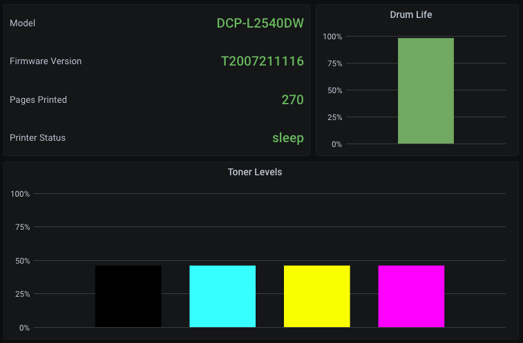

# telegraf-brother-printer
Collect Brother printer statistics through Telegraf

## Installation
Check your Python version and make sure version 3.8 or newer is installed on your system:
```
$ python3 --version
```

Install required python3 modules:
```
$ pip3 install asyncio json brother
```

Make `brother-printer.py` executable and optionally copy it to `/usr/local/bin` or somewhere else on your system that is allowed to execute commands

## Usage
Add the following section to `telegraf.conf`, replacing PRINTER_IP and PRINTER_TYPE with your printer's IP address and either `laser` or `ink`:

```
[[inputs.exec]]
  commands = ["/usr/local/bin/brother-printer.py PRINTER_IP PRINTER_TYPE"]
  name_override = "printer"
  data_format = "json"
  tag_keys = ["serial"]
  json_string_fields = ["model", "firmware", "status"]
```

## Grafana Dasboard
Import `grafana-brother-printer.json` into Grafana and select your Telegraf database


# License
Copyright (C) 2021 Sam Steele. Licensed under the Apache License, Version 2.0 (the "License"); you may not use this file except in compliance with the License. You may obtain a
copy of the License at

http://www.apache.org/licenses/LICENSE-2.0

Unless required by applicable law or agreed to in writing, software distributed under the License is distributed on an "AS IS" BASIS, WITHOUT WARRANTIES OR CONDITIONS OF ANY KIND, 
either express or implied. See the License for the specific language governing permissions and limitations under the License.
